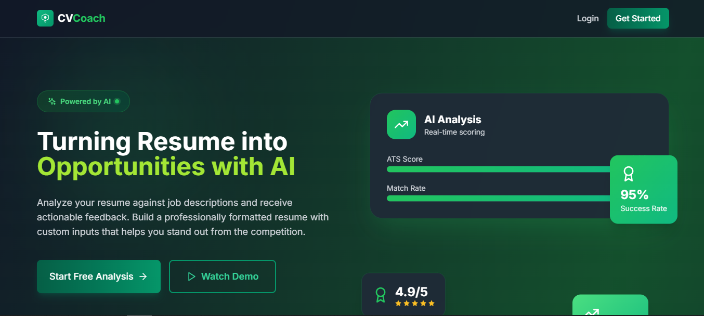

# CVCoach - AI-Powered Resume Analysis & Builder Platform

CVCoach is a comprehensive full-stack web application that helps users analyze, optimize, and build professional resumes using artificial intelligence. The platform provides features like ATS scoring, job matching, AI-powered content generation, and professional resume building.




## Table of Contents

- [Live Demo](#live-demo)
- [Features](#features)
- [Tech Stack](#tech-stack)
- [Project Structure](#project-structure)
- [Getting Started](#getting-started)
- [API Endpoints](#api-endpoints)

## Live Demo

[CVCoach App](https://cvcoach-client.vercel.app/) - Try the live application

## Features

### Resume Analysis

- **ATS Score Calculator** - Evaluate resume compatibility with Applicant Tracking Systems
- **Job Match Analysis** - Compare resume against job descriptions
- **Keyword Extraction** - Identify missing keywords and optimization opportunities
- **AI-Powered Feedback** - Get intelligent suggestions to improve your resume

### Resume Builder

- **Drag-and-drop Interface** - Create professional resumes easily
- **AI Content Generation** - Generate professional summaries, experience descriptions, and skills
- **Live Preview** - See your resume in real-time as you edit
- **Export Options** - Download as PDF, DOCX, or PNG

### User Management

- **Authentication** - Email/password and Google OAuth login
- **Credit System** - Purchase credits for premium features
- **History Tracking** - View past analysis and built resumes

## Tech Stack

### Frontend

- **React 18** with TypeScript
- **Vite** for build tooling
- **Redux Toolkit** for state management
- **TailwindCSS** for styling
- **React Router** for navigation
- **Framer Motion** for animations
- **React Quill** for rich text editing

### Backend

- **Express.js** with TypeScript
- **MongoDB** with Mongoose
- **Google Gemini AI** for AI-powered features
- **Stripe** for payment processing
- **Passport.js** for authentication
- **Multer** for file uploads

## Project Structure

```
app/
├── backend/                 # Express.js backend API
│   ├── src/
│   │   ├── config/         # Configuration files
│   │   ├── controllers/    # Request handlers
│   │   ├── middlewares/    # Express middlewares
│   │   ├── models/         # Mongoose models
│   │   ├── routes/         # API routes
│   │   ├── services/       # Business logic
│   │   ├── db/             # Database connection
│   │   └── utils/          # Utility functions
│   └── package.json
│
└── frontend/               # React frontend application
    ├── src/
    │   ├── api/           # API client
    │   ├── components/    # React components
    │   ├── hooks/         # Custom hooks
    │   ├── pages/         # Page components
    │   ├── store/         # Redux store
    │   ├── types/         # TypeScript types
    │   └── utils/         # Utility functions
    └── package.json
```

## Getting Started

### Prerequisites

- Node.js 18+
- MongoDB (local or Atlas)
- Google Cloud Platform account (for Gemini AI)
- Stripe account (for payments)

### Installation

1. **Clone the repository**

   ```bash
   git clone <repository-url>
   cd app
   ```

2. **Install backend dependencies**

   ```bash
   cd backend
   npm install
   ```

3. **Install frontend dependencies**

   ```bash
   cd frontend
   npm install
   ```

4. **Configure environment variables**

   Create `backend/.env`:

   ```env
   PORT=5000
   MONGO_URI=your_mongodb_connection_string
   JWT_SECRET=your_jwt_secret
   GOOGLE_CLIENT_ID=your_google_client_id
   GOOGLE_CLIENT_SECRET=your_google_client_secret
   GEMINI_API_KEY=your_gemini_api_key
   STRIPE_SECRET_KEY=your_stripe_secret_key
   STRIPE_WEBHOOK_SECRET=your_stripe_webhook_secret
   FRONTEND_URL=http://localhost:5173
   ```

   Create `frontend/.env`:

   ```env
   VITE_API_URL=http://localhost:5000/api
   VITE_STRIPE_PUBLISHABLE_KEY=your_stripe_publishable_key
   ```

### Running the Application

1. **Start the backend**

   ```bash
   cd backend
   npm run dev
   ```

   Backend runs on http://localhost:5000

2. **Start the frontend**

   ```bash
   cd frontend
   npm run dev
   ```

   Frontend runs on http://localhost:5173

3. **Build for production**

   ```bash
   # Backend
   cd backend
   npm run build
   npm start

   # Frontend
   cd frontend
   npm run build
   npm run start
   ```

## API Endpoints

### Authentication

- `POST /api/auth/register` - Register new user
- `POST /api/auth/login` - User login
- `GET /api/auth/me` - Get current user
- `POST /api/auth/refresh-token` - Refresh access token
- `POST /api/auth/logout` - User logout

### Resumes

- `POST /api/resumes/upload` - Upload resume file
- `GET /api/resumes` - Get all user resumes
- `GET /api/resumes/:id` - Get single resume
- `PUT /api/resumes/:id` - Update resume
- `DELETE /api/resumes/:id` - Delete resume

### Analysis

- `POST /api/analysis/generate` - Generate AI analysis
- `GET /api/analysis` - Get all analyses
- `GET /api/analysis/:id` - Get single analysis
- `DELETE /api/analysis/:id` - Delete analysis

### ATS Score

- `POST /api/ats-score` - Calculate ATS score

### Job Match

- `POST /api/job-match` - Match resume to job

### Resume Builder

- `POST /api/resume-builder` - Create resume from content
- `GET /api/resume-builder/templates` - Get available templates

### Payment

- `POST /api/payment/create-checkout-session` - Create Stripe checkout
- `POST /api/payment/webhook` - Stripe webhook handler
- `GET /api/payment/verify/:id` - Verify payment status
